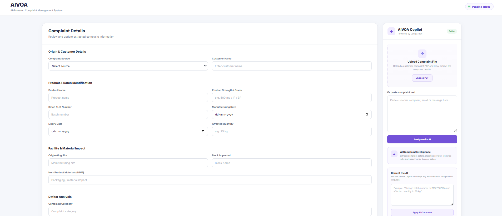
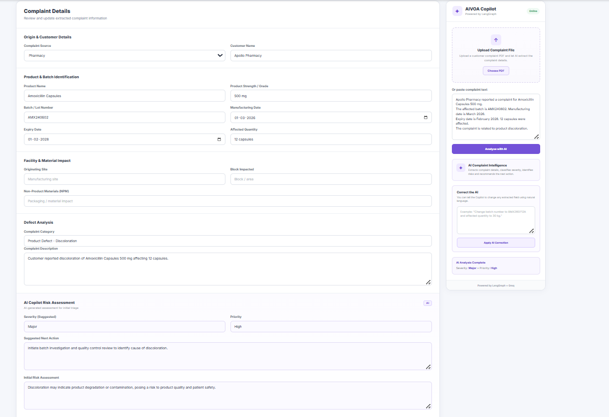
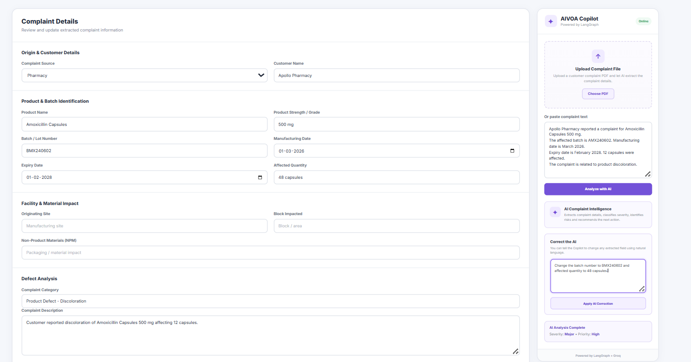
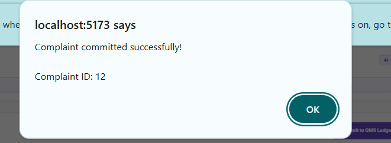
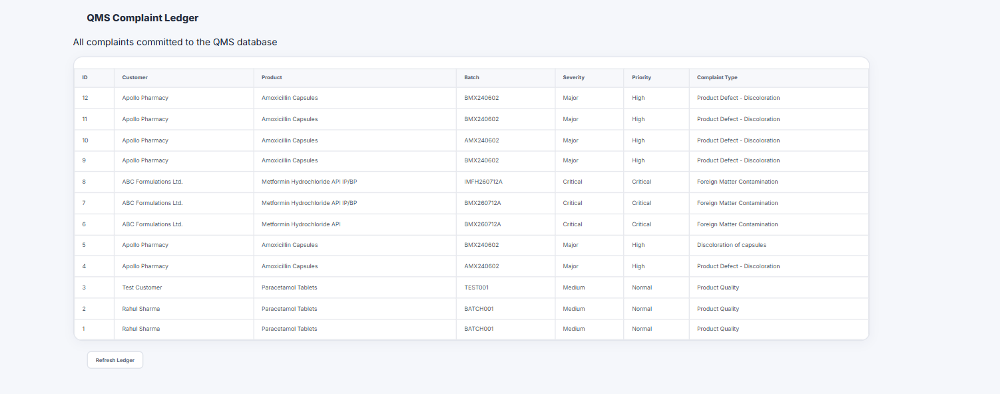

# AIVOA AI Complaint Management System

An AI-powered Customer Complaint Management System designed for pharmaceutical manufacturing.

The system helps Quality Assurance teams capture, analyze, classify, and manage customer complaints using AI, LangGraph, FastAPI, React, Redux, and a QMS complaint ledger.

---

## 🚀 Features

### AI-Powered Complaint Processing

- Extract complaint information from unstructured text
- Analyze uploaded PDF complaints
- Automatically populate complaint form fields
- Conversational correction of extracted information
- AI-powered severity and risk assessment
- Suggested next actions

### AI Tools

- **Complaint Completeness Checker**
  - Identifies missing complaint information
  - Highlights fields that require additional details

- **Root Cause Recommendation**
  - Suggests possible root causes
  - Recommends investigation areas and records to review

- **Duplicate Complaint Detection**
  - Compares a new complaint against existing QMS complaints
  - Provides confidence and matching complaint information

- **CAPA Recommendation**
  - Suggests corrective and preventive actions
  - Recommends QA verification and responsible functions

- **Complaint Summary**
  - Generates a concise complaint summary
  - Provides key details, risk overview, and recommended action

- **AI Risk Classification**
  - Classifies overall complaint risk
  - Determines severity and priority
  - Provides risk factors and rationale

### QMS Complaint Ledger

- Commit processed complaints to the database
- View previously committed complaints
- Track complaint ID, customer, product, batch, severity, priority, and complaint type

---

## 🏗️ Technology Stack

### Frontend
- React
- Redux Toolkit
- Axios
- Vite
- Google Inter Font

### Backend
- Python
- FastAPI
- Pydantic
- SQLAlchemy

### AI
- LangGraph
- Groq
- LLM-powered structured complaint analysis

### Database
- MySQL / PostgreSQL compatible architecture

### Document Processing
- PDF text extraction using PyPDF

---

## 🧠 AI Workflow

```text
Customer Complaint
        │
        ▼
Text / PDF Input
        │
        ▼
FastAPI Backend
        │
        ▼
LangGraph AI Workflow
        │
        ├── Complaint Data Extraction
        ├── Risk Assessment
        ├── Severity Classification
        └── Suggested Next Action
        │
        ▼
Structured Complaint Data
        │
        ▼
React + Redux Frontend
        │
        ▼
AI Copilot Risk Assessment
        │
        ▼
Quality Review / Correction
        │
        ▼
QMS Complaint Ledger

## Screenshots

### 1. Initial Complaint Interface



### 2. AI Complaint Analysis



### 3. AI-Powered Correction



### 4. QMS Ledger Commit



### 5. QMS Complaint Ledger


